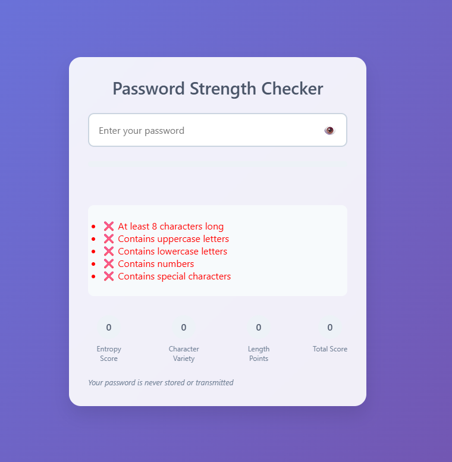

# 🔐 Password Strength Checker

A clean, emoji-based password strength checker built with HTML, CSS, and JavaScript.

[](https://vxqrds.github.io/password-strength-checker/)

---

## 📸 Preview



---

## ✨ Features

* ✅ Live strength feedback with emojis
* 🔐 Entropy, character variety, and length scoring
* 📊 Visual progress bar + clear scoring system
* 🧠 Secure — all checks run in-browser, nothing is sent

---

## 🚀 How to Use

1. Clone the repo:

```bash
git clone https://github.com/vxqrds/password-strength-checker.git
cd password-strength-checker
start index.html       # Windows  
open index.html        # macOS  
xdg-open index.html    # Linux
```

---

## 🛠️ Built With

* 🧱 HTML5
* 🎨 CSS3 (Flexbox, transitions)
* ⚙️ JavaScript (Vanilla JS only)

---

## 📁 Project Structure

```plaintext
password-strength-checker/
├── index.html          # Main UI  
├── style.css           # Stylesheet  
├── script.js           # Core password logic  
└── preview.png         # Screenshot used in README
```

---

## 📄 License

This project is open-source and licensed under the [MIT License](LICENSE).

---

## 🙋‍♂️ Author

By [@vxqrds](https://github.com/vxqrds)

---

## 🤝 Contributing

Pull requests are welcome. If you have ideas to improve the checker (better UX, stronger evaluation logic), feel free to contribute:

1. Fork the repo
2. Create your feature branch: `git checkout -b feature/YourFeature`
3. Commit your changes: `git commit -m 'Add your feature'`
4. Push to the branch: `git push origin feature/YourFeature`
5. Open a pull request

---

## 📬 Contact

Got questions or feedback? Open an issue or reach me on GitHub.
